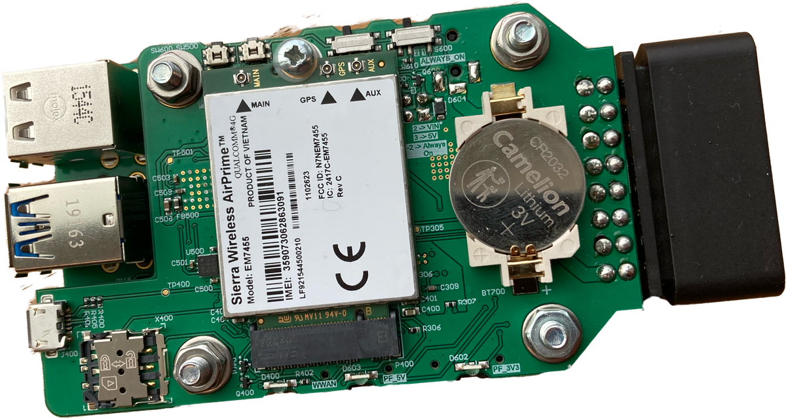
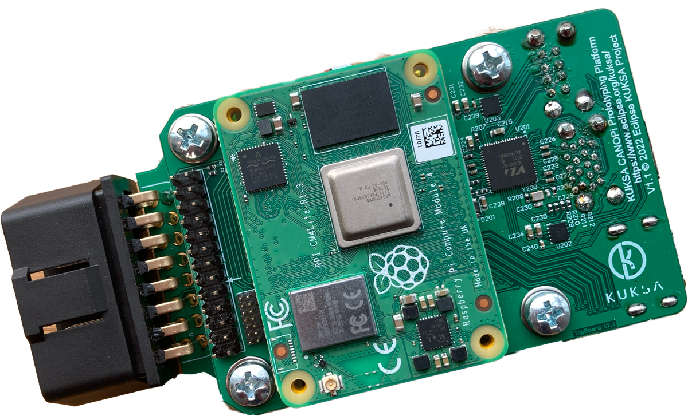

## DMuffler Hardware Dongle v1 

This repository contains information and manufacturing files for the CANOPi automotive prototyping plattform.

  

The DMuffler Hardware Dongle is a baseboard for the [Raspberry Compute Module 4 (CM4)](https://www.raspberrypi.com/products/compute-module-4).

With a DMuffler Hardware Dongle you have all the ingredients for hacking vehicles and prototyping Software Defined Vehicle functions and applications.

 * Compatible with the Raspberry Pi ecosystem thanks to the CM4
 * Up to 8GB of RAM and up to 32GB eMMC or any size micro SD card storage
 * Integrated SIM card slot and M2 slot to add cellular connectivity
 * Can be powered via a vehicle's [OBD-2 Port](https://en.wikipedia.org/wiki/On-board_diagnostics#OBD-II) 
 * [STN2120 OBD-II](https://www.obdsol.com/solutions/chips/stn2120/) to access vehicle data on OBD (only CAN supported by hardware)
 * Two [MCP251xFD](https://www.microchip.com/en-us/product/MCP2518FD) based [CAN-FD](https://en.wikipedia.org/wiki/CAN_FD) interfaces allowing interfacing two vehicle classic CAN or CAN FD busses directly.
 * [PCF85036A Realtime clock](https://www.nxp.com/products/peripherals-and-logic/signal-chain/real-time-clocks/rtcs-with-ic-bus/tiny-real-time-clock-calendar-with-alarm-function-and-ic-bus:PCF85063A)

## What you can find here
 * Find schematics board renders and BOM lists in [./Component_Documentation/](./Component_Documentation/)
 * You can find GERBER files needed to manufacture the PCB in [./GerberFiles](./GerberFiles) 
 * [Altium Designer](https://www.altium.com/altium-designer) EDA project file nn case you want to modify the schematics can be found in [./EDA](./EDA). 

## How to setup

If you set up a fresh CM4 that has never been used before in CANOPi you need to update the EEPROM first

 * [Updating CM4 EEPROM for DMuffler Dongle](./Software_Documentation/update_eeprom.md)

 In order to make full use of all hardware components, you need to configure your Raspberry OS

  * [Enabling Hardware support in your OS](./Software_Documentation/configure_raspberryos.md)

If you use a compute module with integrated flash (eMMC), read

 * [How to flash eMMC compute modules](./Software_Documentation/flash-emmc.md)
